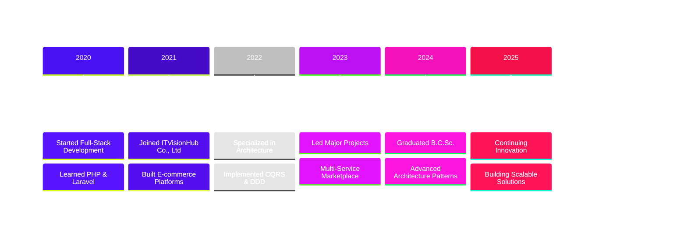

# 💫 Hi There! I'm Kay Zin Khaing

  
  
  

### ✨ *"Code with clarity, Deliver with speed, Aim for excellence"* ✨

---

## 🌸 About Me

💜 **Passionate about** creating elegant solutions for complex problems  
🚀 **Specialized in** fintech, marketplace, and e-commerce platforms  
🎯 **Focused on** modern architecture patterns and scalable systems  
🌱 **Always learning** new technologies and best practices  

---

## 💻 Tech Stack & Tools

### 🎨 Frontend Development

### ⚙️ Backend Development

### 🗄️ Database & Caching

### 🛠️ DevOps & Tools

### 🏗️ Architecture Patterns

---

## 📊 GitHub Analytics

  

---

## 🎯 What I Bring to the Table

**🏗️ Architecture Expertise**
- CQRS & Event-Driven Architecture
- Domain-Driven Design (DDD)
- Microservices & API Design
- Repository Pattern & SOLID

**💻 Development Skills**
- Full-Stack Web Development
- Real-time Features & WebSockets
- Payment Gateway Integration
- OAuth2 & JWT Authentication

**🚀 DevOps & Deployment**
- Docker Containerization
- CI/CD Automation
- Cloud Deployment
- Performance Optimization

**🤝 Soft Skills**
- Strong Team Collaboration
- Agile Methodology
- Problem-Solving Mindset
- Clear Communication

 

---

## 🌈 Professional Journey

---

## 💼 Work Experience

<table>
<tr>
<td width="60%">

### 🏢 ITVisionHub Co., Ltd
**Full-Stack Web Developer** | *2022 - Present*

- 🚀 Developed high-traffic fintech & marketplace platforms
- ⚡ Implemented real-time features (notifications, tracking, dashboards)
- 🏗️ Applied CQRS & DDD for scalable architecture
- 🔄 Automated CI/CD pipelines
- ✅ Delivered high-quality code with comprehensive testing

</td>
<td width="40%">

</td>
</tr>
</table>

---

## 🌸 Let's Connect!

### 💜 Open for Freelance Projects & Full-Time Opportunities

---

### ✨ *"Code with clarity, Deliver with speed, Aim for excellence"* ✨

